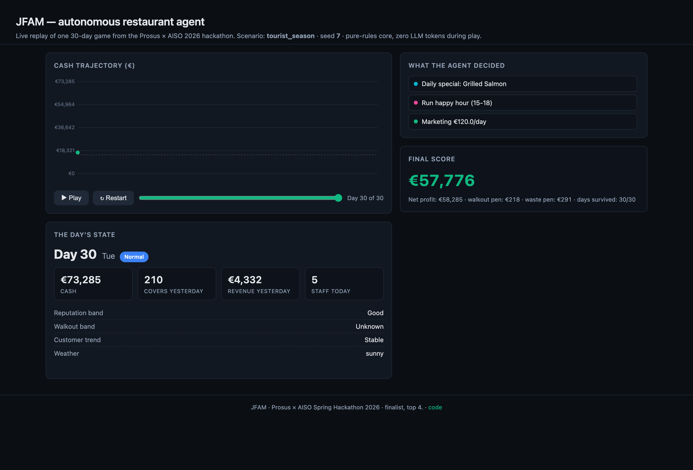
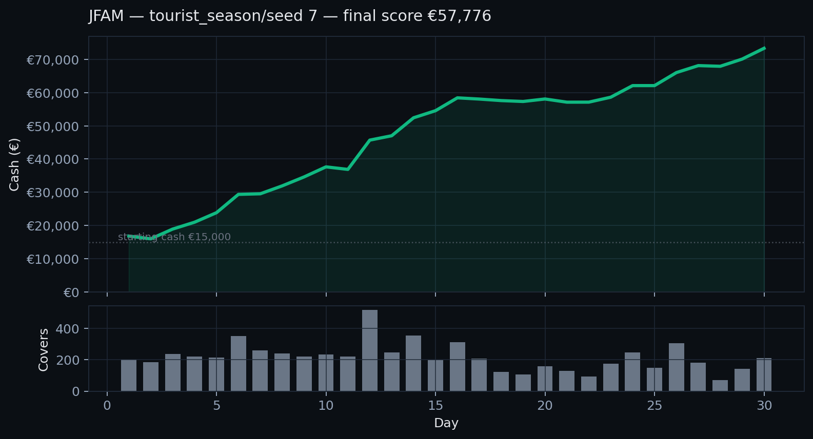
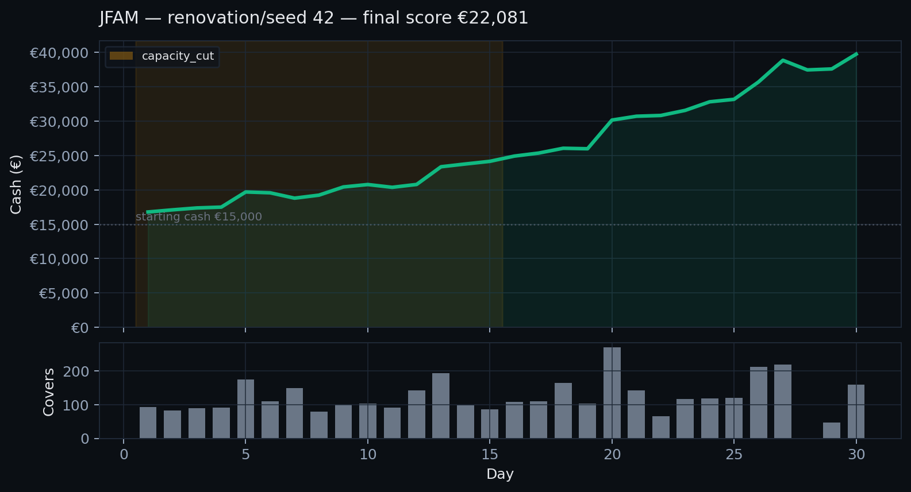

# JFAM: autonomous restaurant agent

**Placed 4th of 16 at the Prosus × AISO Spring Hackathon 2026.** An autonomous AI agent that runs a simulated 22-table Italian restaurant for 30 days. Final eval: 45,900 average across 20 random-seed games, 0 bankruptcies, worst game €20,153.

<video src="docs/video/demo.mp4" controls muted playsinline width="100%" poster="docs/img/demo_end.png">
  Your browser does not support inline video. <a href="docs/img/demo_end.png">See the static screenshot</a> instead.
</video>



## What it does

Each game day, JFAM observes inventory, cash, weather, supplier state, and customer signals over a REST API, then submits tool calls: order ingredients, set menus and prices, hire staff, run marketing, pick daily specials. The game runs 30 in-game days; the agent has a 30-second tick budget. The full game rule-book lives in [AGENT_CONTRACT.md](AGENT_CONTRACT.md).

The hackathon's final evaluation ran every submission on 10 scenarios × 2 random seeds nobody had seen. JFAM cleared all 20 cells.



## Final ranking

| # | Team | Avg | Best | Worst | Bankrupt |
|---|------|----:|-----:|------:|---------:|
| 1 | mostly_italian_waiters | 55,280 | 70,609 | 26,140 | 0 |
| 2 | MargheritAI | 53,022 | 74,087 | 27,025 | 0 |
| 3 | Estain | 47,190 | 57,795 | 26,943 | 0 |
| **4** | **JFAM_agents** | **45,900** | **65,400** | **20,153** | **0** |
| 5 | nonna2 | 43,914 | 61,228 | 12,989 | 0 |

Two teams in the bottom half went bankrupt on a random-seed cell (worst games €-335 and €-805). Our worst was €20,153. Teams with bankruptcies finished outside the top 8.

## Architecture

Three layers, all Python, around 1,500 lines:

1. **Deterministic core.** Safety rules for cash reserve, inventory replenishment, pricing band, staff floor. Closes the failure modes that drop teams to bankruptcy.
2. **Regime detector.** Reads only observable game signals (`alerts`, `customer_trend`, `reputation_band`, `walkout_band`) and tags each day with one of `capacity_cut`, `supply_crisis`, `inflation`, `demand_surge`, `reputation_shock`, `premium`, `soft_demand`, or `normal`. Each tag shifts the core's setpoints.
3. **Offline analyst loop.** Claude reads failure traces between matrix runs and proposes parameter or rule changes. We validate every candidate on a deterministic 24-game gate before merging. The live agent never calls an LLM.

The renovation scenario shows the regime detector at work. The orange band marks the `capacity_cut` regime persisting for 14 days from a single alert on day 1.



## Run it

```bash
pip install -r requirements.txt
export RESTBENCH_URL=http://52.48.183.209:8001    # if the hackathon server is still up

# Single game
python -m agents.jfam_agent baseline 42

# Full matrix (4 known scenarios × 3 seeds, parallel)
python -m agents.evaluate agents.jfam_agent --seeds 7,55,99 --parallel 3

# Interactive HTML replay (opens in your browser)
python -m agents.jfam_demo tourist_season 7 --open
```

Terminal output from a single game:

```
Game 9570...0585 ▸ tourist_season/7 ▸ cash 15000
  Day  1 [        normal] cash   16844 | covers 202 | rev €  4155 | 22 actions
  Day  6 [        normal] cash   29377 | covers 351 | rev €  7621 |  7 actions
  Day 12 [        normal] cash   45688 | covers 518 | rev € 11051 | 11 actions
  Day 20 [        normal] cash   58052 | covers 159 | rev €  3391 |  7 actions
  Day 30 [        normal] cash   73285 | covers 210 | rev €  4332 |  3 actions
Status: completed
Final score: €57,776 · days survived 30/30
```

## What didn't work

- **Putting an LLM in the live decision loop.** Tested with `gpt-4.1-mini` and `gpt-5.4-mini`. Both scored worse than the tuned rules on every scenario we tried.
- **Per-seed Optuna sweeps.** Added 3-5k average on the seeds we could test, then broke on a different seed. We threw those wins away.
- **Rotating daily specials.** Three of four held-out cells came back byte-identical, so the lever has near-zero effect.

## Files

- [`agents/jfam_core.py`](agents/jfam_core.py): deterministic core, regime detector, forecasting.
- [`agents/jfam_agent.py`](agents/jfam_agent.py): submission entrypoint.
- [`agents/jfam_demo.py`](agents/jfam_demo.py): runs a game and emits a self-contained HTML replay.
- [`agents/jfam_scenariolab.py`](agents/jfam_scenariolab.py): offline stress lab; runs the locked agent through all 10 archetypes server-free.
- [`agents/jfam_oodlab.py`](agents/jfam_oodlab.py): adversarial drift harness for OOD validation.
- [`CLAUDE.md`](CLAUDE.md): full design notes, experiment log, what we rejected and why.

## Team

[TEAMMATE 1], [TEAMMATE 2], Max [MAX LAST NAME], and me (Jasper). I wrote most of the agent code. Max owned the pitch that put us in the finals.
